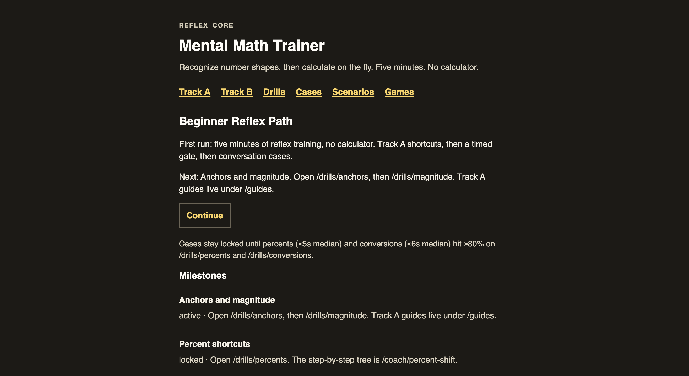
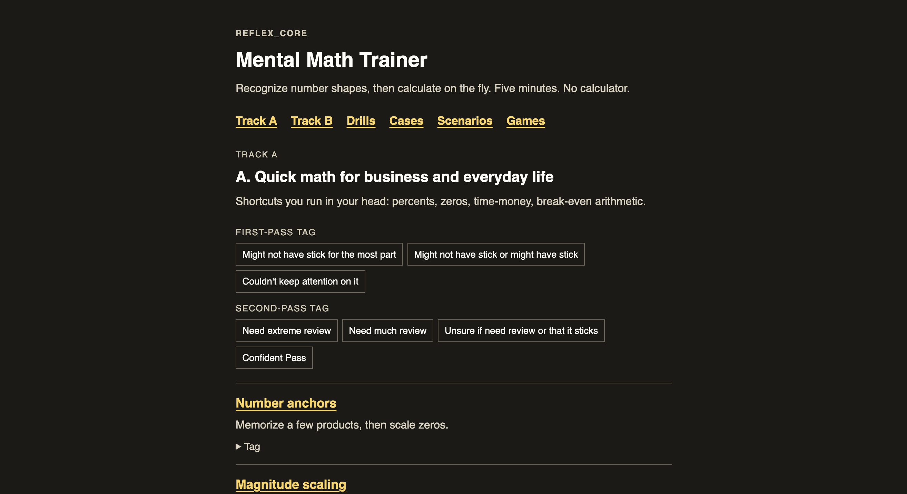
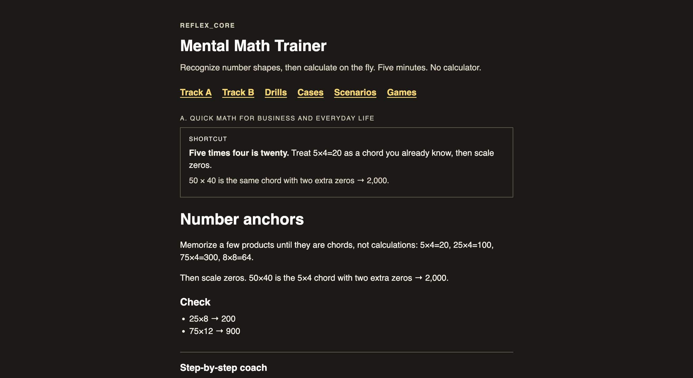
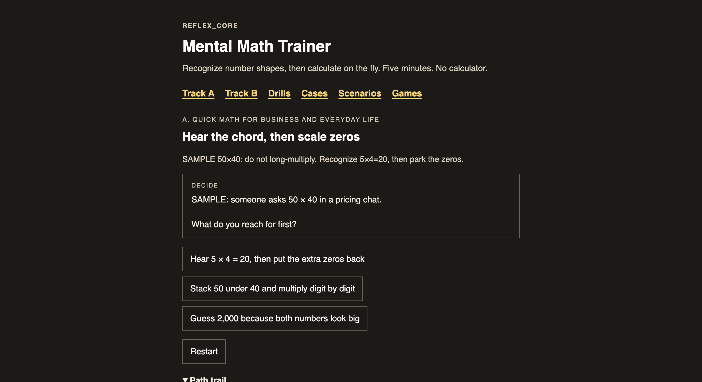
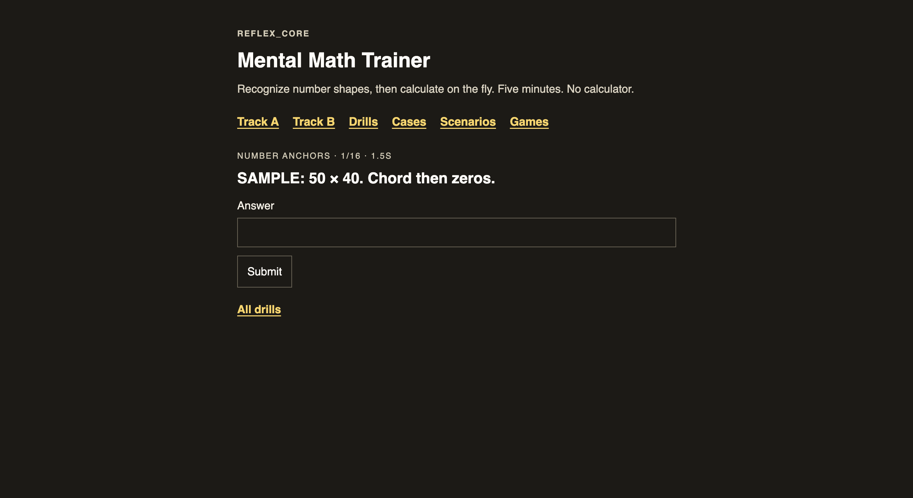
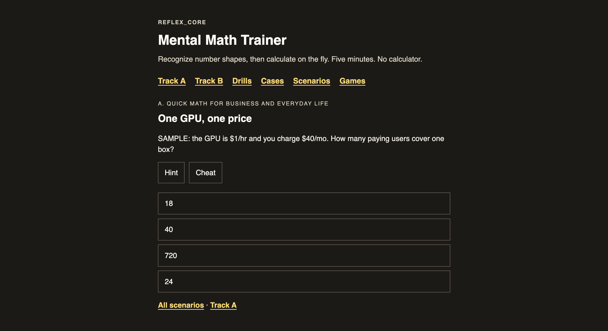
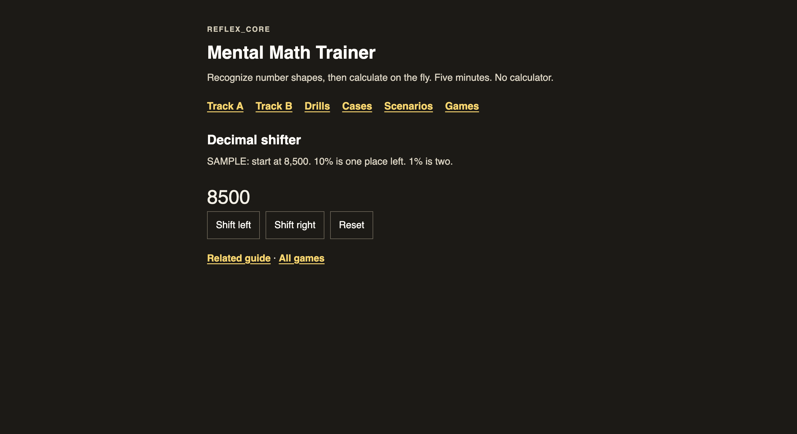

# Mental Math Trainer

By Weng (Weng Fei Fung) 
<a target="_blank" href="https://github.com/Siphon880gh" rel="nofollow"></a>
<a target="_blank" href="https://www.linkedin.com/in/weng-fung/" rel="nofollow"></a>
<a target="_blank" href="https://www.youtube.com/@WengTeachesCode/" rel="nofollow"></a>

Learn mental math for everyday life and business meetings.

Recognize number shapes, then calculate on the fly. Five minutes. No calculator. Every prompt uses SAMPLE numbers only.

## Screenshots

Home is the Beginner Reflex Path — Track A shortcuts, a timed drill gate, then conversation cases. The logo in the header returns here; there is no separate Home nav link.



Track A is everyday and business fluency. Track B is stakeholder and planning math. Tag a guide on first pass or second pass, then filter the list (OR match), same pattern as [leetcode-coach](https://github.com/Siphon880gh/leetcode-coach).



Each guide has a shortcut, the principle, and a link to the step-by-step coach on the same slug:



The coach is a choice tree: wrong path explains, then rewinds. Step back, restart, and a path trail stay on the page.



Timed drills are typed banks. Cases stay locked until percents (median ≤5s) and conversions (median ≤6s) both hit ≥80%.



Scenarios are multi-skill multiple choice with Hint and Cheat. They are not behind the fluency gate.



Mini-games teach one motion (decimal shift, percent swap, percent chips):



## How it works

Open a track, read the shortcut, walk the coach, then drill until the number is a reflex. Cases ask you to type a number in a conversation, then show the thought chain. Scenarios mix skills from the same track. Games isolate one mechanic.

PHP server-renders every URL. Progress and pass tags live in the browser (`localStorage`). Internal name: REFLEX_CORE.

## What you get

| Section | Role |
|---------|------|
| **Home** `/` | Beginner Reflex Path, milestones, fluency gate copy |
| **Track A** `/track-a` | Everyday / business shortcuts (percents, zeros, time-money, break-even) |
| **Track B** `/track-b` | Stakeholder planning math (runway, NRR, dilution, TAM, stacked infra) |
| **Guides** `/guides/:slug` | Shortcut + lesson; coach on the same slug |
| **Coach** `/coach/:slug` | Deterministic choice tree with wrong paths and step-back |
| **Drills** `/drills` | Timed banks; Beginner unlocks; gate to Cases |
| **Cases** `/cases` | Typed conversation packs (locked until the timed gate) |
| **Scenarios** `/scenarios` | Multi-skill MCQ, Hint, Cheat — always open |
| **Games** `/games` | Decimal shifter, percent swap, percent chips |

## Run locally

PHP 8.2+ and [Composer](https://getcomposer.org/).

```bash
composer install
composer serve
```

Then open `http://localhost:8080`. Equivalent: `php -S localhost:8080 router.php`.

The front controller is `index.php` at the project root, so Apache/nginx can point the document root at this folder (DirectoryIndex `index.php`). `/` and `/index.php` both load Home. CSS and JS stay under `public/assets/` and are exposed as `/assets/...`.

If the document root is `public/` instead, `public/index.php` still works.

**MAMP:** Apache here is still PHP 7.4 globally, but this folder runs through MAMP’s PHP 8.2 CGI (`php82.cgi`). Open `http://localhost:8888/weng/app/math/`. To use 8.2 for every MAMP site instead, set **Preferences → PHP → 8.2.0** and restart Apache.

```bash
./vendor/bin/phpunit
```

This is not a static site. Hosting needs PHP (built-in server, Apache, or nginx). `/archive` and `/guides` redirect to `/track-a`.

## Context libraries

Shallow-clone sibling trainers for local reference (gitignored; not part of the app):

```bash
bash context/clone.sh
```

See [`context/README.md`](context/README.md) for the catalog.

## Internals

Design spec, stories, and agent loops (not required to run the trainer):

| Doc | Role |
|-----|------|
| [`docs/superpowers/specs/2026-09-10-mental-math-trainer-design.md`](./docs/superpowers/specs/2026-09-10-mental-math-trainer-design.md) | Design spec |
| [`EPIC_MAP.md`](./EPIC_MAP.md) | Epics and P0 order |
| [`IMPLEMENTATION_STORIES.md`](./IMPLEMENTATION_STORIES.md) | Stories + acceptance |
| [`AGENTS_LOOP-Continue-Milestone.md`](./AGENTS_LOOP-Continue-Milestone.md) | Milestone loop |
| [`LOOPS/LOOP-Graph.md`](./LOOPS/LOOP-Graph.md) | Content graph loop |
